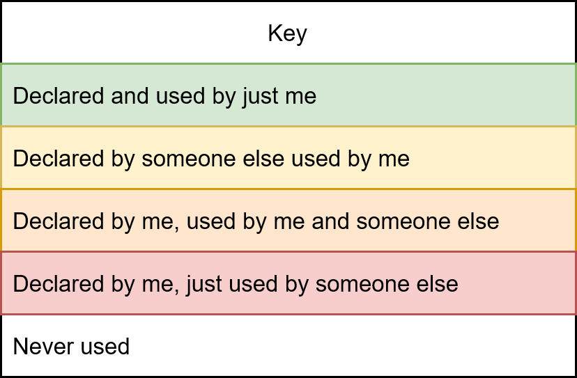
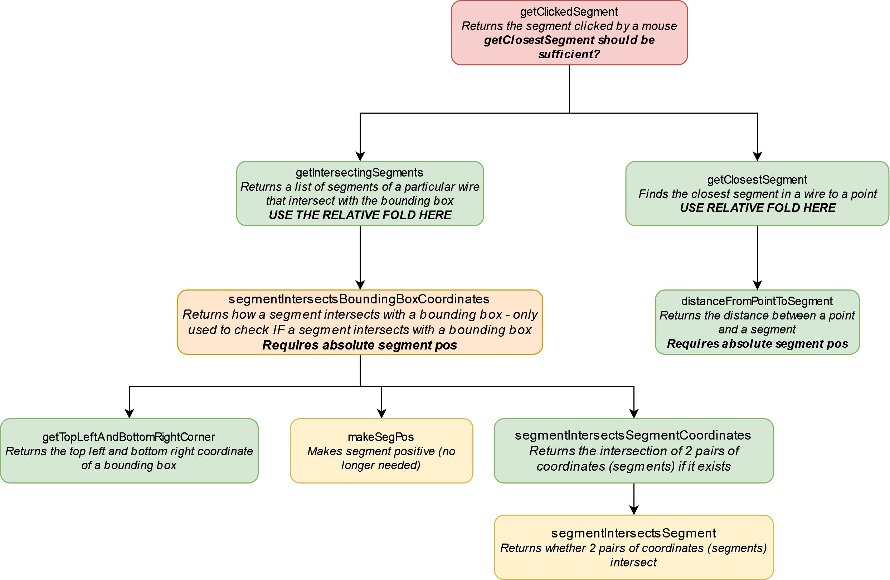
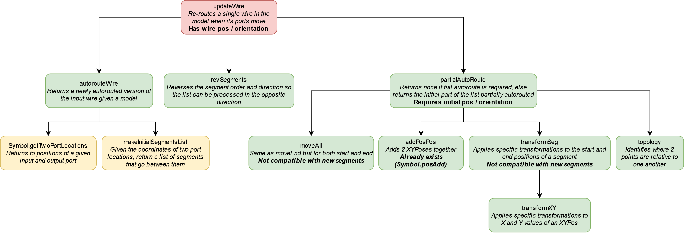
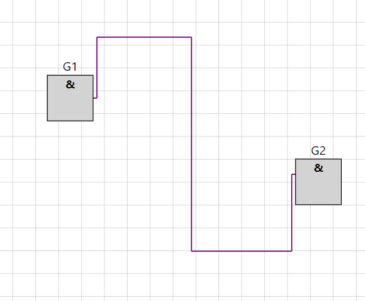
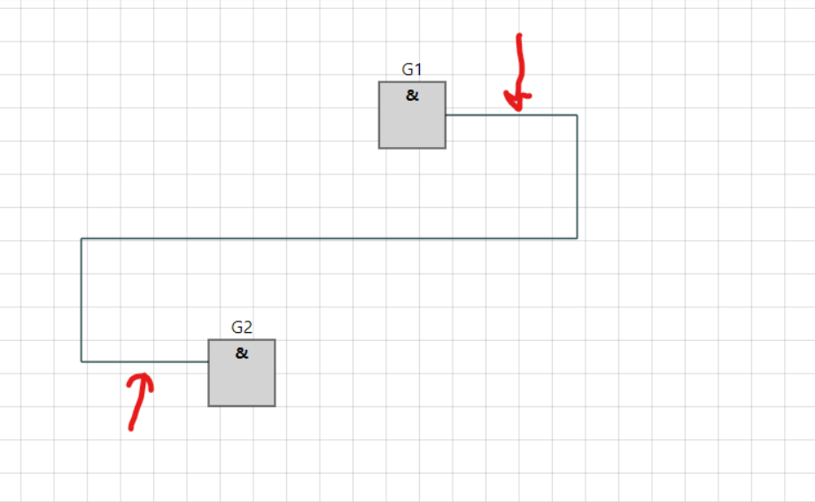
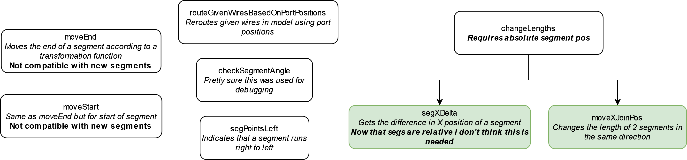
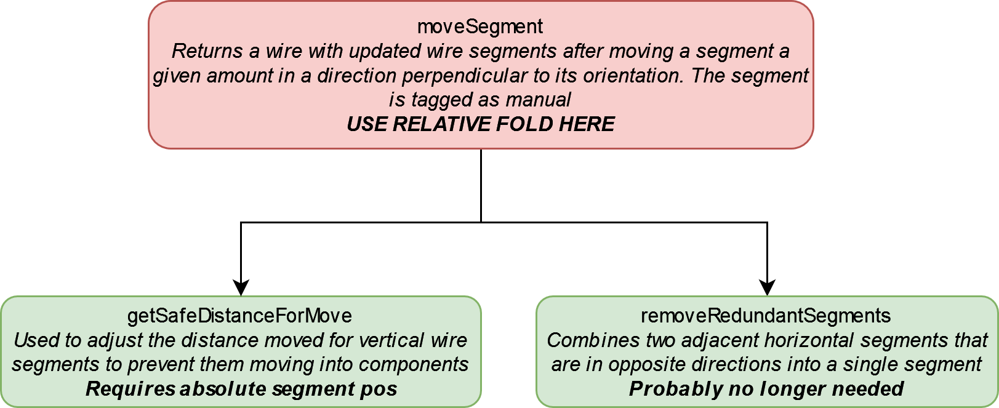
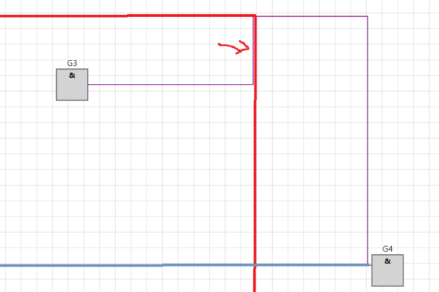

# Inidividual Submission for sts219

## Admin and quick access links

[Common repo Team9 file](https://github.com/tomcl/hlp22docs/blob/main/Team9.md)

[Buswire (section 2)](src/renderer/drawblock/buswire.fs)

Section 2 on my file is lines: 850-1371 
I am also responsible for: 
- lines 104-250 (foldOverSegs, Debugging functions)
- lines 1766-188 (Rotate Msg in Update, wireIntersectsBoundingBox)
- Changing the BoundingBox type (and updating parts of Sheet.fs to reference it correctly)

Changes to the types used in Buswire were decided as a team with the people working on the other sections.

## Code Quality

**Highlights**
* Helper function `foldOverSegs` is really useful, allowing us to implement functions which require absolute segment positions by generating them on the fly.
* Reworking how intersections between segments and bounding boxes are calculated, especially the `intersect1D` higher order function.
* Renaming `topology` to `relativePosition` and changing the return type to significantly improve readbility. 

## Analysis

All call graphs shown below have the following key to define function interdependencies:

### Issues in Existing Code

#### Bad Function list

List any problems with the existing code **concisely**  as numbered points one function per point. State why
the problem exists. List only functions with **significant problems**. You can should refer to XML comments 
in your refactored code where this helps. You may note the worst 3 functions even if they have problems that are not
significant.

* if function is poorly documented say why this is necessary (what is not obvious from a good name + 
* parameter names + types).
* if function has bad name say why this is confusing
* if a function is poorly written indicate what rewriting would improve this (briefly). You can 
refer to your code if this helps.

**getClickedSegment**
This function was an overcomplicated and confusing mess:

This function has a simple purpose, which is to find the closest segment to a mouse-click, but has decided to do this in 2 different ways:
- `getIntersectingSegments`: returns a list of segments which intersect the bounding box created by a mouseclick
- `getClosestSegment`: returns the closest segment
If the list of segments returned by `getIntersectingSegments` is empty, the segment returned by defined by `getClosestSegment`, otherwise the first segment in the list is returned. This is problematic as:
- The first segment in this list has no guarantee on being the closest segment (although the difference is probably inperceptible by a user)
- Since `getClosestSegment` is returned in the case where no segments intersect the bouding box, there is no reason not to use this function exclusively (since it is more accurate than the other sub-function, and isn't more computationally expensive)
- The underlying maths behind `getClosestSegment` are wrong, as they assume that a perpendicular line from the segment to the mousclick can always be drawn. Whilst this issue is unlikely to ever get noticed by the user, it could cause some incorrect behaviour at corners between segments.

These issues have been addressed in my refactored code by completely removing `getIntersectingSegments`, and instead relying on a fixed version of `getClosestSegment`

**segmentIntersectsBoundingBoxCoordinates**
This function was one of the sub-functions called by `getClickedSegment` (see call graph above), and returns *how* a segment intersects a bounding box using a tuple of (bool, XYPos option). This return type is unintuitive, is not well reflected by the function name, and is never even properly used. In both functions that call it, it is simply being used to check *if* segments intersect a bounding box, and not *how*. This means that the entire function is not needed, as `segmentIntersectsBoundingBox` can be used instead.

**partialAutoRoute / topology**
This function is part of the top level `updateWire` function, which has the following call graph:

This function is too long, and uses some sub-function / other functions which have particularly bad names. `topology` is one of the worst offenders, with no documentation as to what the function is meant to do. The `scaleBeforeSegmentEnd` sub-function is also very confusing, with unhelpful variable names and long lines of code. This could be improved by moving some functions out of the `partialAutoRoute`, improving the names of these functions and variables and adding documentation explaining the purpose of this function.

#### Other problems

State **concisely** Issues with existing code, or in refactoring for new types, that do not fit into per function list. 
Again numbered points, at most 3. Choose the most inmportant if you have too much to say. You can should
refer to documentation (not XML docs) in code where this helps.

**Segments and their usage in Wires**
This type has several issues:
- Segments containing both a start and an end position is duplicate information
- Negating the XYPos of a segment is an awful way of indicating that a wire is being manually routed, and leads to `abs` being used everywhere in the code
This was improved as follows:
- Segments only contain a length, and alternating segments are in opposite orientations. The sign of the length indicates whether the wire runs in an increasing or decreasing X/Y direction.
- Segments contain a `Mode` attribute, which is either `Manual` or `Auto` to indicate how the wire is being routed.
- The initial / final positions and orientations are stored in the wire. Both endpoints are stored to allow the wire to be processed from either direction.
There were 2 types of segment lists considered in the existing Issie functionality ('3'-seg and '5'-seg) to route between different IO configurations. A lot of their functionality was hard coded in using this assumed 7-segment length, which is bad as it makes it more difficult to include new cases for alternate port orientations. In both cases, the wires have small 'nubs' at both ports. This allows all the visible segments in the 3-segment wire to be dragged:

However, for the 5-segment wire, the following segments cannot be dragged:

This is because 8 segments would be needed to support this. As a result, one of the 7 segments are completely unused. By adapting the number of wire segments to the different routing problems, we can ensure that all wires can be moved appropriately.

**BoundingBox**
The main issue with this type is what its `X` and `Y` fields represent. Is it the center of the box, the top left, or something else entirely. There is no documentation on the type itself, and quite literally no-one seemed to know definitively (our advisor, TC, etc.). From it's usage in the code, it was determined that these fields represent an `XYPos` of the top left corner of the boundingbox. I therefore switched these `X` and `Y` fields for a single `TopLeft: XYPos` field, which should avoid any future confusion.

**Unused functions**
There were a significant amount of functions, some quite complex, that were never called anywhere in the code (see below):

Those with debugging utility were moved into the debugging section at the top of the code, functional ones were removed.

### Analysis of how/why code works

This section need not contain analysis if the code can be demonstarted working. In 
that case list as bullet points the features you will demonstarte (quickly) in the 5 min
interview.

* If code works fully and can be demonstrated in the 5 minute feedback interview no analysis is needed. 
* If code will be manually tested in interview say what the tests are that supplement your analysis
* Interview code must be the assessed branch (not something else, or using later group code)
* A good way to show code works is to explain how it differs from existing working code and how existing
functionality is preserved.

All the functionality of the new code described below will be demonstrated in the 5-min interview. Some of the changes in functionality were addressed in the problem lists above, and will not be repeated here. From a high level perspective, all the existing functionality was preserved / updated:
- Selecting different segments
- Moving wire segments
- Autorouting wires depending on which port is moved
- Partial autorouting

**moveSegment**
This function allows individual segments of a wire in Issie to be dragged in a direction perpendicular to its orientation. It's original call tree is below:

`getSafeDistanceForMove` is meant to prevent users from dragging wire segments perpendicular to the port orientation too close to the port. This was implemented by hard-coding the different behaviour for different wire indexes. It also doesn't consider cases where the nubs have vertical orientations. This current implementation results in some glitchy behaviour when moving certain segments of the wire. This functionality was reworked and generalised:
- The binding segment for a port is the first non-zero segment with an opposite orientation to the nub of that port.
- This binding segment cannot be moved past the nub.
- Non-binding segments of opposite orientation to the nub may be moved past the nub.
This new functionality removes the glitches of the previous implementation and generalise to all types of port rotation.
The `removeRedundantSegments` function was needed to combine adjacent segments that had the same orientation. This function can be completely removed as adjacent segments are now perpendicular by definition.

**filterWiresByCompMoved**
This function returns 3 different lists of wire Ids which are used in the `updateWires` function to determine what type of wire routing to call. The functionality here was preserved, but more functional abstraction was used to minimise the code duplication in the original version of the code. The return type of this function was also changed to an anonymous record rather than a tuple to clarify what each list represents. There is some replicated code between this function and `getConnectedWires` (renamed `getConnectedWireIds`), but as these were both functions that interfaced with sections of the code out of my scope I wanted to try and keep both.

**partialAutoRoute**
The old conditions for autorouting to be applied can be have the following requirements:
*Definitions:*
- `startPos`: The startPos of a wire is defined as the port position if the manual index is 1, otherwise it's the end of the nub.
- `newStartPos`: The startPos of the wire based on the new port position.
- `fixedPoint`: The fixedPoint is the *end* of the manual segment travelling from the port moved. 
- `endPos`: The position of the end of the nub from the unmoved port.
- The quadrant of `newstartPos` relative to `fixedPoint` must be the same as the quadrant of `startPos` relative to `fixedPoint`
- The quadrant of `newStartPos` relative to `endPos` must be the same the quadrant of `startPos` relative to `endPos`

These requirements can be illustrated graphically:

The second condition causes the additional blue line seen above. I have removed this requirement, as I think it is more intuitive to only have the bounds shown by the red lines. I also reworked the partial autorouting logic to update the necessary segments by the difference between `newStartPos` and `startPos`, rather than scaling segments using a multiplier.

# Extensions

1.  Support for all orientations when autorouting (both full and partial).

     a. Reworked every rounting function to support this behaviour 
     b. Created `rotateStartDest` and `rotateSegments` to normalise routing problems before calling `makeInitialSegmentList`.

