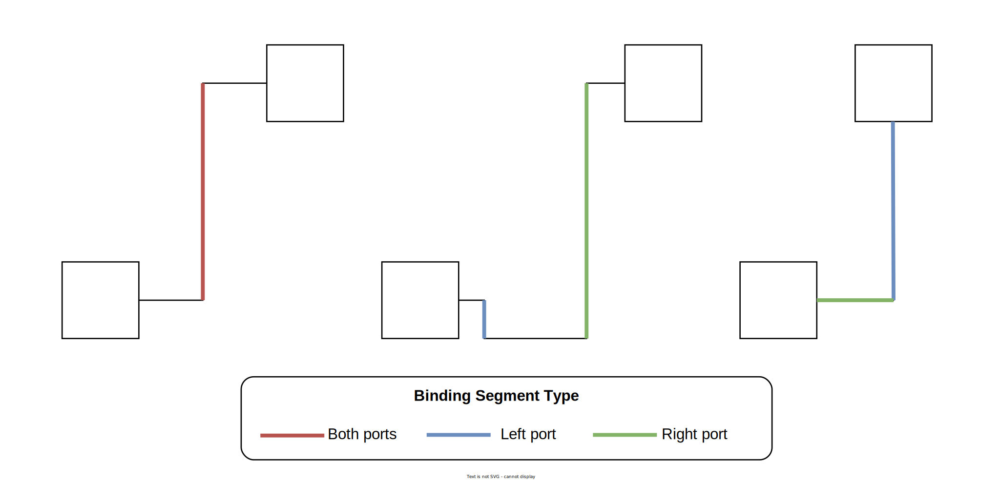

    Algorithms for: auto-route, auto-sizing and placing of ports, stickiness or smart routing
    Algorithmic descriptions should refer to any relevant style or configuration constants, which should be easily accessible in a configuration section of the code.

- [Buswire](#buswire)
  - [Manual routing](#manual-routing)
  - [Auto-route](#auto-route)
    - [Initial Segment List](#initial-segment-list)
  - [Partial Auto-routing](#partial-auto-routing)
- [Symbols](#symbols)
  - [Auto-sizing](#auto-sizing)
  - [Port placement](#port-placement)

# Buswire

## Manual routing
Manual routing has been fully reworked to have the following behaviour:
- A **non-binding segment** can be dragged anywhere
- A **binding segment** cannot be dragged past the **nebLength** of the wire, which is the minimum length of the nubs coming out of the ports (defined as `static member nubLength = 8.0` in `Wire` type)

A segment is defined as binding for a particular port if it is the first segment of non-zero length perpendicular to the port's nub. See the diagram below for examples:

## Auto-route
Auto-routing is done in 3 stages:
1. Normalise the routing problem so that the output port is facing right
2. Generate the [initial segment list](#initial-segment-list)
3. Rotate the problem back to it's in the original orientation

### Initial Segment List
Segments are generated based off of the two ports for each wire, with the assumption that the output port is always facing right. The orientation of the input port is checked as well as its relative position to the output port, allowing us to generate an initial segment list. This segment list consists of a small “nub” segment immediately joining the input and output port. These are followed by 0 length segments in order to facilitate previous functionality of ISSIE where we could drag wires fully. After these 0 length segments we create the remaining segments to link the two ports. These distances are either set to halfway between the two ports, or a small distance in order to get past the boundaries of a symbol.

## Partial Auto-routing

# Symbols

## Auto-sizing

## Port placement